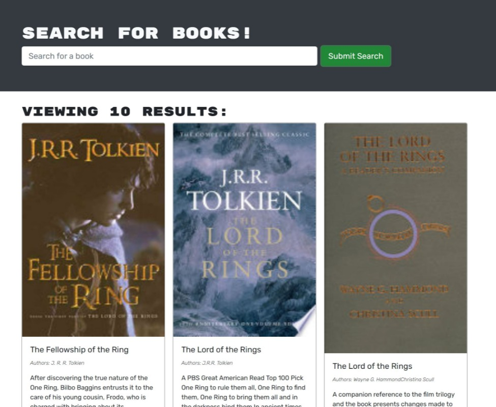

# book-search-engine

A user will be able to login/signup, search for books using Google's book API, and save books to their own account which will show them the author, title, description, image and link to the books they have saved. User will also be able to delete their books from their saved page.

[Link to live website (please give it about 30 seconds to start up)](https://btw-google-book-search.herokuapp.com/)

## Table of Contents

- [Installation](#installation)
  
- [Usage](#usage)
  
- [Questions](#questions)

## Installation

No installation required for this app, it has a functioning front end. 

## Usage

To use this app you just need to visit the live link

[Link to live website (please give it about 30 seconds to start up)](https://btw-google-book-search.herokuapp.com/)

## Questions

You can find more of my work at [BTDubbzzz-gitHub](https://github.com/BTDubbzzz).

If you have any questions about the repo, open an issue or contact me directly at wright.blake.t@gmail.com
